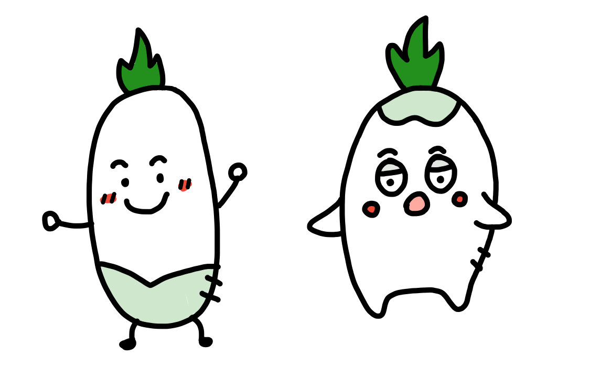
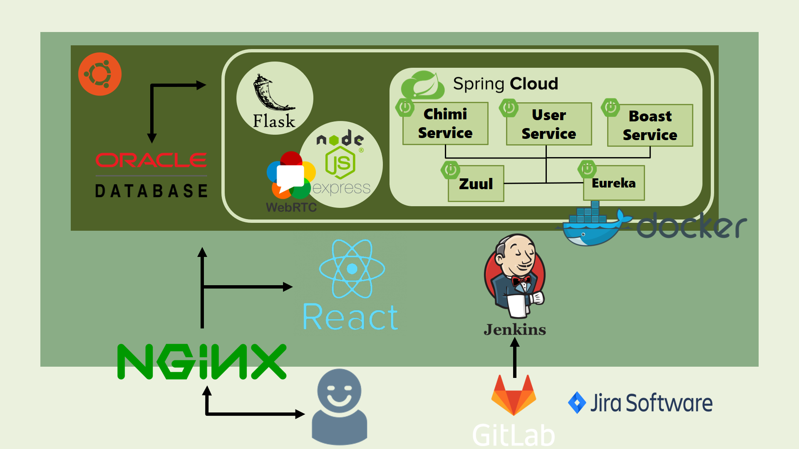
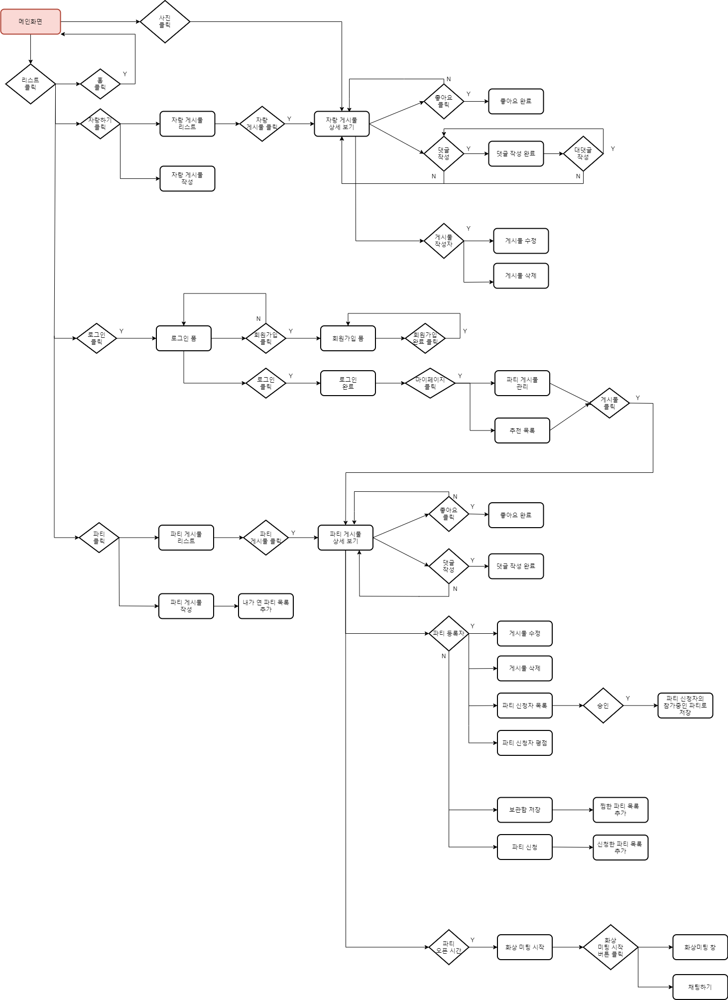
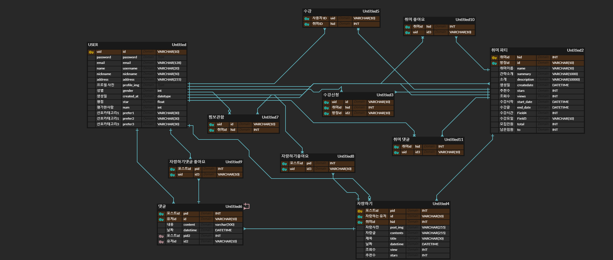

# 🍊 동취미
> 同취미  
> 동년배들의 취미  
> 같은 취미를 공유하다

 

## 🌟 프로젝트 개요
- 코로나 사태로 인해 야외 활동에 대한 제한이 엄격해졌다. 
- 그리하여 많은 사람들이 집에서 할 수 있는 취미생활을 찾아나서기 시작했다.
- 우리는 이런 경향을 보고 사용자의 취향에 맞는 취미생활을 추천해주고, 잘 만들어가고 있는지 사진을 찍거나 영상을 통해 코치받을 수 있는 서비스를 만들어보고자 했다.

 

## 🚀 주요 서비스 및 기능
1. 실시간 화상 채팅을 이용한 취미 생활 공유
2. 사용자의 선호도 및 연령대를 기반으로 한 취미 추천
3. 취미 자랑과 소통을 위한 게시판
4. MSA 구조

 

## 🔗 시스템 구성도

 

## 📜 시스템 흐름도

 

## 📚 ERD

 

## 🐣 SSAFY 3기 자율 PJT 4반 9팀
- ~~고유진 (취업)~~
- 김지현
- 김형준
- 박성빈
- 최윤주 (팀장)

 

## 🌱 branch
- `master` : 최종 브랜치
- `docs` : 기획 자료, 리드미 등 문서 관리
- `develop` : 개발 단계 최종 브랜치
- `backend` : 백엔드 단계 최종 브랜치
- `frontend` : 프론트엔드 단계 최종 브랜치
- `feature` : 기능별 브랜치

 

## 📧 깃 커밋 메세지 양식
### `[label] <지라 이슈 번호> : <title>`
### [lable] 리스트
- feature : 새로운 기능 
- bug : 버그 수정
- update : 비즈니스 로직 변경
- design : 디자인 변경
- docs : 문서 (문서 추가, 수정, 삭제) 
- test : 테스트
- refactor : 코드 리팩토링
- ~ing : 개발중 ..중간저장
- etc : 기타 변경사항 

 

## 🤝 그라운드 룰
1. 코딩테스트나 면접 일정은 미리 말하고 양해 구하기
2. 9 to 6에는 프로젝트에 전념하기
3. 읽씹 금지 (긍정이든 부정이든 의사표현)
4. 일주일에 한 번 이상 오프라인
5. 불편함, 불만사항 등은 바로바로 얘기하기
6. 웹엑스 들어와있기 (점심시간, 쉬는시간 제외)
7. 쉬는 시간은 알아서 편하게 쉬세요 (말만 해주세요)
8. 열심히하기…..
